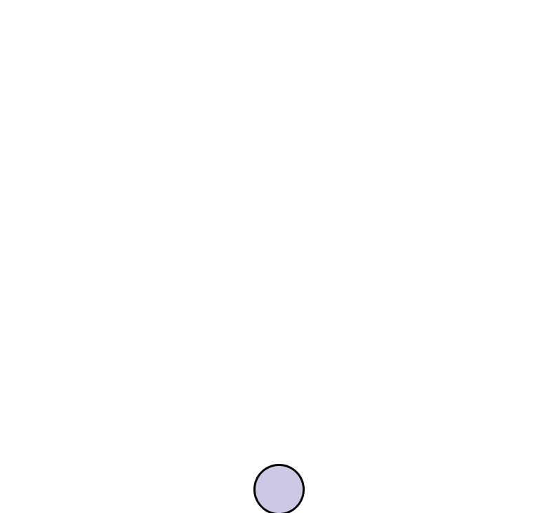
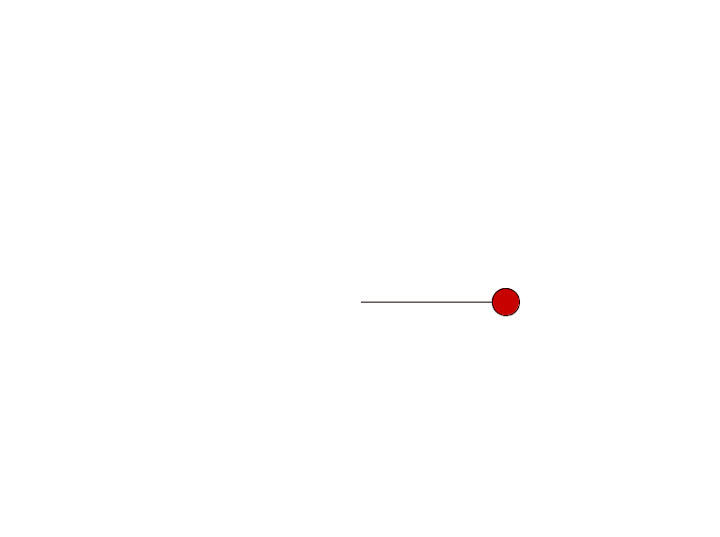
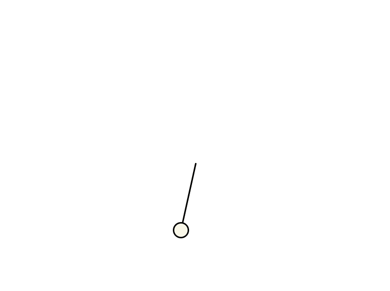
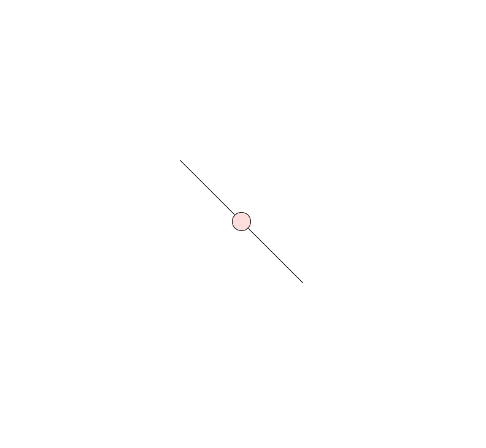
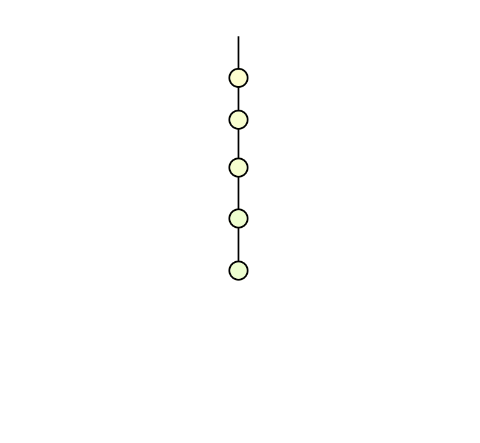
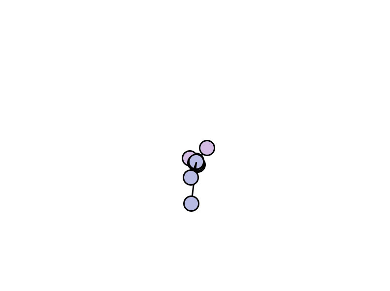

### physics-simulations

## Demonstrates some basic physics with Processing

# Ball bouncing with gravity

# Simple Oscillator

# Damped Oscillator

# Two spring oscillator

# Many balls on one string

# Many balls on many strings

# Two ball on string

